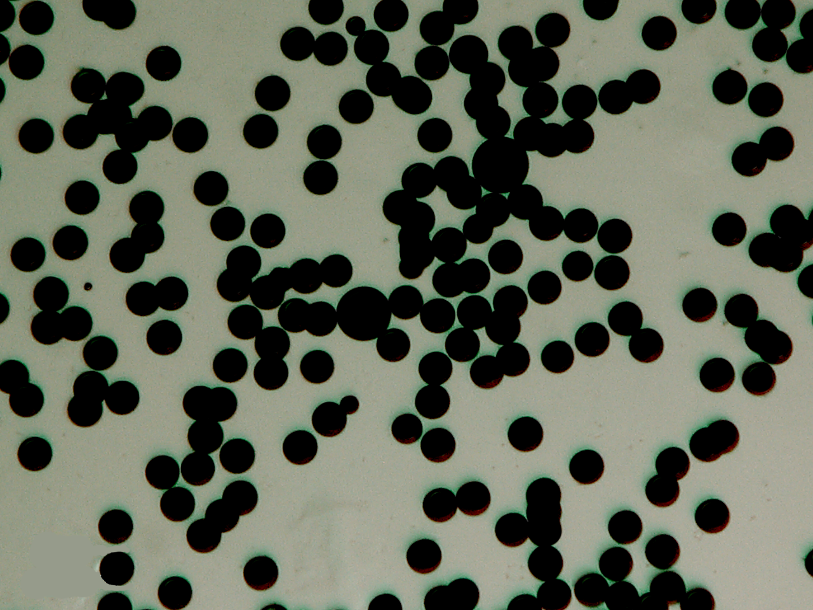

# Particle Detection and Aggregation Analysis

A robust tool for analyzing particle distributions and aggregation patterns in microscopy images.

[](https://www.python.org/downloads/)
[](LICENSE)
[](https://doi.org/10.5281/zenodo.15621111)

## Overview

This repository contains the code used for particle detection and aggregation analysis.

The tool identifies particles in microscopy images, analyzes their size distribution, and characterizes their aggregation patterns. Each detected particle is measured for properties such as area, diameter, and circularity. Particles are also analyzed for aggregation patterns, with each aggregate assigned a unique color in the visualization.



## Features

- **Particle Detection**: Robust detection of particles using distance transform
- **Morphological Analysis**: Measurement of particle size, shape, and circularity
- **Aggregation Analysis**: Identification of particle aggregates and isolation status
- **Nearest Neighbor Analysis**: Calculation of nearest neighbor distances for spatial distribution analysis
- **Visualization**: Color-coded visualization of particles based on their aggregation state
- **Data Export**: Comprehensive results exported to Excel for further analysis

## Requirements

This code requires Python 3.7 or higher. All dependencies are listed in the `requirements.txt` file.

```
pip install -r requirements.txt
```

## Usage

The script can be run directly from the command line with various optional parameters:

```
python blob_detector_with_aggregation.py --image images/om/250X1.png
```

### Command-line Arguments

| Argument | Description | Default |
|----------|-------------|---------|
| `--image` | Path to the input image | images/om/250X1.png |
| `--output` | Path to save the output Excel file | blob_results_extended_colored.xlsx |
| `--padding` | Padding size in pixels | 5 |
| `--contact-factor` | Aggregation contact factor - multiplier for determining particle contact | 1.1 |
| `--save-image` | Save the visualization image to the specified path | (None) |
| `--no-display` | Do not display the visualization window | False |

### Examples

Analyze a specific image with custom output:
```
python blob_detector_with_aggregation.py --image your_image.png --output your_results.xlsx
```

Adjust the aggregation detection sensitivity:
```
python blob_detector_with_aggregation.py --contact-factor 1.2
```

Save the visualization for publication:
```
python blob_detector_with_aggregation.py --save-image figure1.png
```

Batch processing (no display window):
```
python blob_detector_with_aggregation.py --image batch/sample1.png --output batch/results1.xlsx --no-display
```

## Output

The script generates:

1. An Excel file containing detailed measurements for each particle, including:
   - Spatial coordinates (x, y)
   - Area (pixels and μm²)
   - Diameter (pixels and μm)
   - Circularity (%)
   - Nearest neighbor distance (pixels and μm)
   - Aggregation status (aggregate ID and number of particles in aggregate)

2. A visualization window showing detected particles color-coded by aggregate

## Calibration

The default pixel-to-micrometer conversion is set to 100/130 (100 pixels = 130 μm). You can adjust this in the code to match your microscope's calibration.

## License

This project is licensed under the MIT License - see the LICENSE file for details.

## Contact

For questions or issues, please contact:
- Evilasio Filho - evilasio.costa@certbio.ufcg.edu.br
